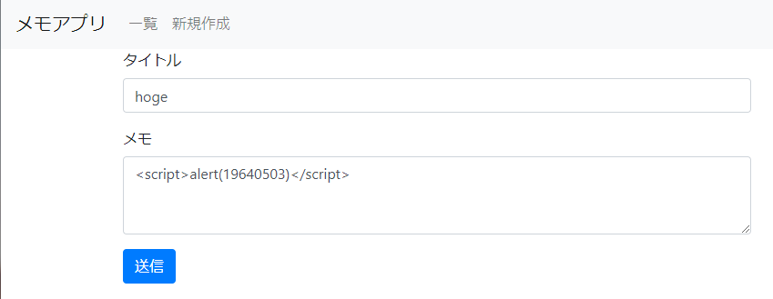

# striped table

```txt
テーブルの行の背景色をストライプにする作業をしてもらったら、こんなことになってしまいました!

ページにjavascript`alert(19640503)`を埋め込み実行させるとフラグが得られます。

<https://striped.wanictf.org/?source>にアクセスするとソースが閲覧できます。

<https://striped.wanictf.org>

writer : suuhito
```

## Solution

問題にアクセスするとメモを作成できるページに表示されます。

問題文にあるように、ソースコードを閲覧してみます。

```php
<?php
if (isset($_GET['source'])){
  highlight_file(__FILE__);
  die();
}
session_start();
$results = [];
if (isset($_SESSION["memos"])) {
  $results = $_SESSION["memos"];
}

function delete_memo($memo) {
  return $memo["id"] !== $_GET["delete"];
}

if (isset($_GET["delete"])) {
  $results = array_filter($results, "delete_memo");
  // インデックスを振りなおす
  $results = array_values($results);
  $_SESSION["memos"] = $results;
  header('Location: /', true, 301);
  exit;
}
?>
<?php include( $_SERVER['DOCUMENT_ROOT'] . '/includes/meta-header.php'); ?>
  <table class="table">
    <thead>
      <tr>
        <th>ID</th>
        <th>タイトル</th>
        <th>メモ</th>
        <th>削除</th>
      </tr>
    </thead>
    <tbody>
      <?php foreach ($results as $index => $result) : ?>
        <?php if ($index % 2 === 0) : ?>
          <tr>
            <td><?= $result['id'] ?></td>
            <td><?= htmlspecialchars($result['title'], ENT_QUOTES) ?></td>
            <td><?= nl2br(htmlspecialchars($result['memo'], ENT_QUOTES)) ?></td>
            <td><a href="/?delete=<?= $result['id'] ?>"><button type="button" class="btn btn-danger">削除</button></a></td>
          </tr>
        <?php else: ?>
          <tr style="background-color: #f0f0f0">
            <td><?= $result['id'] ?></td>
            <td><?= htmlspecialchars($result['title'], ENT_QUOTES) ?></td>
            <td><?= nl2br($result['memo']) ?></td>
            <td><a href="/?delete=<?= $result['id'] ?>"><button type="button" class="btn btn-danger">削除</button></a></td>
          </tr>
        <?php endif; ?>
      <?php endforeach; ?>
    </tbody>
  </table>
<?php include( $_SERVER['DOCUMENT_ROOT'] . '/includes/footer.php'); ?>
```

以上のコードから以下に注目します。
```php
 <?php else: ?>
          <tr style="background-color: #f0f0f0">
            <td><?= $result['id'] ?></td>
            <td><?= htmlspecialchars($result['title'], ENT_QUOTES) ?></td>
            <td><?= nl2br($result['memo']) ?></td>
            <td><a href="/?delete=<?= $result['id'] ?>"><button type="button" class="btn btn-danger">削除</button></a></td>
          </tr>
        <?php endif; ?>
```

これより、どうやら背景が黒くなる部分のメモが記載される部分のみ入力値をサニタイズする `htmlspecialchars()` がないことがわかります。

なので背景が黒くなる偶数目のメモの部分で JS を埋め込んで実行させることができそうです。 (XSS)



すると JS が実行されてアラートの内容に以下の flag　が表示されます。

```txt
おめでとうございます！ FLAG{simple_cross_site_scripting}
```

## Flag

```txt
FLAG{simple_cross_site_scripting}
```
